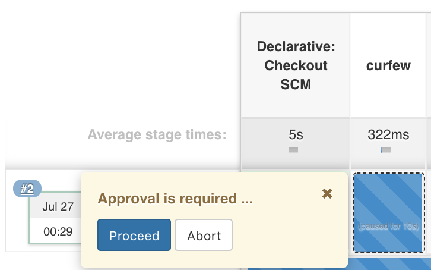

# datetime-constraint

[](https://plugins.jenkins.io/datetime-constraint)


datetime-constraint is a Jenkins plugin that enables you to set time restrictions (configurable through the UI), that can be applied to any stage in the pipeline, by simply calling the method `curfew()`. If someone triggers a Jenkins pipeline outside of your allowed timeframe, the pipeline will be aborted, unless manually approved through the UI prompt.

### Contents
1. [Getting started](#Getting-started)
2. [Jenkinsfile examples](#Jenkinsfile-examples)
3. [Showcase](#Showcase)

## Getting started

* Go to **Manage Jenkins** > **Manage Plugins** > **Available**
* Filter for `datetime-constraint`.
* Click `Install without restart.`
* Find `Curfew` and set your configuration (timezone, restricted times/days).
* In your Jenkinsfile simply call `curfew()` at any stage.

If you need more help you can also read the [official Jenkins guide for plugin installation](https://jenkins.io/doc/book/managing/plugins/).

**Settings example:** (Mon-Thu prevent before 08:00 and after 16:00, Fri time restriction all day, no restrictions Sat-Sun).


## Jenkinsfile examples

**Declarative Pipeline**

```
pipeline {
  agent any
  stages {
    stage('curfew') {
      steps {
        script {
          curfew()
        }
      }
    }
  }
}
```

**Scripted Pipeline**

```
node {
  stage('curfew') {
    curfew()
  }
}
```

## Showcase

Following you will find a demonstration of what the prompt for manual approval looks like, in case someone triggers the pipeline outside of the allowed timeframe:



## Contact
hidrijouda@gmail.com

## License
This project is licensed under the MIT License.
